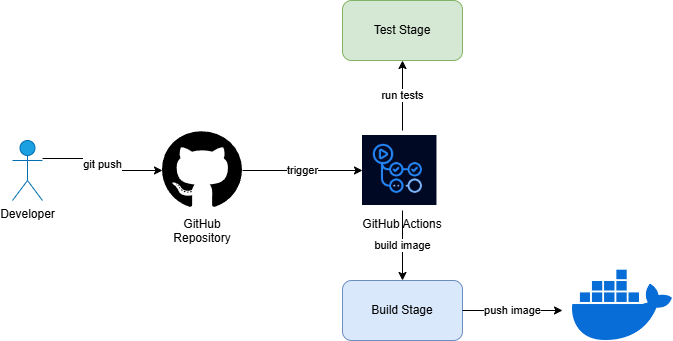

# Devsu Technical Test - API REST

Este proyecto implementa una API REST con Django y se despliega en AWS EKS usando Terraform para la infraestructura y GitHub Actions para CI/CD.

## Arquitectura

### Diagrama de Infraestructura AWS

Este diagrama muestra la infraestructura AWS completa, incluyendo:
- VPC con subnets públicas y privadas
- EKS cluster
- Application Load Balancer
- CloudWatch para logs y métricas

### Diagrama de CI/CD

El pipeline de CI/CD incluye:
- Integración con GitHub
- Tests automatizados
- Build de imagen Docker
- Despliegue a EKS

### Diagrama de Flujo de API

La API REST proporciona:
- Listado de usuarios (GET /api/users/)
- Creación de usuarios (POST /api/users/)
- Detalle de usuario (GET /api/users/{id}/)

### Diagrama de Kubernetes

La arquitectura de Kubernetes incluye:
- Pods de Django
- ConfigMaps y Secrets
- Service tipo ClusterIP
- Ingress con ALB
- Auto-scaling

## Componentes Principales

### 1. API REST (Django)
- Framework: Django REST Framework
- Base de datos: SQLite (desarrollo)
- Endpoints:
  - GET /api/users/
  - POST /api/users/
  - GET /api/users/{id}/

### 2. Infraestructura AWS (Terraform)
- **VPC**
  - 3 subnets públicas
  - 3 subnets privadas
  - NAT Gateway
  - Internet Gateway

- **EKS Cluster**
  - Versión: 1.27
  - 2 nodos t3.medium
  - Auto-scaling: 1-3 nodos

- **Application Load Balancer**
  - Health checks
  - Target Groups
  - Security Groups

- **CloudWatch**
  - Logs del cluster
  - Logs de aplicación
  - Dashboard personalizado
  - Alarmas de CPU y errores

### 3. CI/CD (GitHub Actions)
- **Test Stage**
  - Ejecuta pruebas unitarias
  - Verifica migraciones
  - Validación de código

- **Build Stage**
  - Construye imagen Docker
  - Solo en rama main

## Configuración y Despliegue

### Requisitos Previos

bash
AWS CLI
aws configure
Terraform
terraform -v
kubectl
kubectl version

### Despliegue de Infraestructura

bash
cd terraform
terraform init
terraform plan
terraform apply

### Configuración de kubectl

bash
aws eks update-kubeconfig --region us-west-2 --name devsu-eks-cluster

### Despliegue de la Aplicación

bash
kubectl apply -f k8s/

## Monitoreo y Logs

### CloudWatch Dashboard
- Métricas de ALB
  - Request Count
  - Response Time
  - Error Rates

- Métricas de EKS
  - CPU Utilization
  - Memory Usage
  - Node Status

### Alarmas Configuradas
- CPU Usage > 80%
- Error Rate (5XX) > 10 en 5 minutos

## Seguridad

### Network
- VPC con subnets públicas y privadas
- Nodos EKS en subnets privadas
- ALB en subnets públicas
- Security Groups restrictivos

### IAM
- Roles mínimos necesarios
- Políticas específicas por servicio

## Desarrollo Local

### Requisitos
- Python 3.11
- Docker
- Make (opcional)

### Comandos

bash
Instalar dependencias
pip install -r requirements.txt
Ejecutar tests
python manage.py test
Ejecutar servidor local
python manage.py runserver

## API Endpoints

### GET /api/users/

json
[
{
"id": 1,
"dni": "12345",
"name": "John Doe"
}
]

### POST /api/users/

json
{
"dni": "12345",
"name": "John Doe"
}

### GET /api/users/{id}/

json
{
"id": 1,
"dni": "12345",
"name": "John Doe"
}

## Contribución
1. Fork el repositorio
2. Crea una rama (`git checkout -b feature/amazing`)
3. Commit tus cambios (`git commit -m 'Add amazing feature'`)
4. Push a la rama (`git push origin feature/amazing`)
5. Abre un Pull Request

## Licencia
Este proyecto está bajo la licencia MIT.